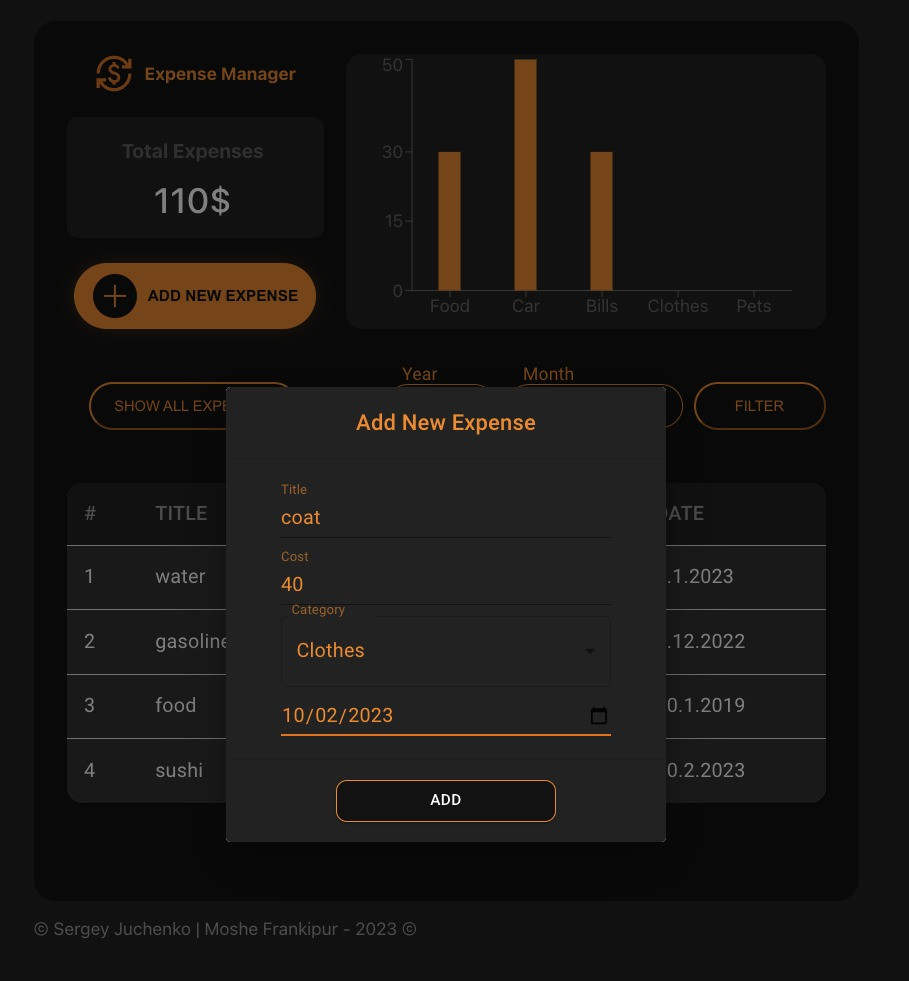
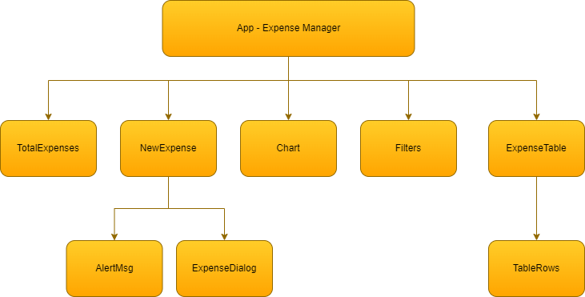

# Expenses Manager

## Component Tree

## Available Scripts

This project was bootstrapped with **ReactJS**.\
In the project directory, you can run:

### `npm install`

This command installs a package, and any packages that it depends on.

### `npm start`

Runs the app in the development mode.\
Open [http://localhost:3000](http://localhost:3000) to view it in your browser.

The page will reload when you make changes.\
You may also see any lint errors in the console.

### `npm run build`

Builds the app for production to the `build` folder.\
It correctly bundles React in production mode and optimizes the build for the best performance.

The build is minified and the filenames include the hashes.\
Your app is ready to be deployed!

## Demo

Click -> [:desktop_computer:](https://expense-manager-hit.netlify.app/)

## Team

> <a href="https://github.com/mfrankii"><kbd></kbd></a> &nbsp; Moshe Frankipour
>
> [Github](https://github.com/mfrankii) | [LinkedIn](https://www.linkedin.com/in/moshe-frank/)

> <a href="https://github.com/srjuchenko"><kbd></kbd></a> &nbsp; Sergey Juchenko
>
> [Github](https://github.com/srjuchenko) | [LinkedIn](https://www.linkedin.com/in/sergey-juchenko/)
